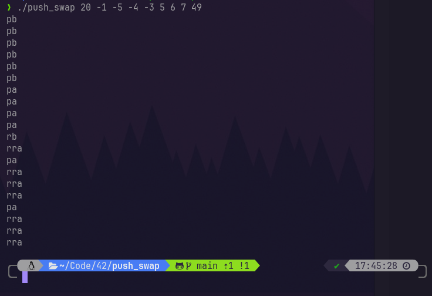

Pushswap project by vsinagl marked by fellow peers as an outstanding project. 
Mark: 125% ✅
Bonus included

# 🥅 Goal of push swap
The push swap project is about sorting numbers using two stacks and defined operations with lowest numbers of operations as possible.

The program at begining recieve the content of the first stack (A). The goal is to sort numbers (lowest to highest) in first stack (A) by using the defined operations and second stack.

## Output:
= list of instructions written in stdout !



## Visualization of Algorhitm
* visualization was made by using visualizer program made by Emmanuel Ruaud and some other contributors, so all credist to them 🖖!* 


# Operations

Allowed operations with stacks are:
- swaping
- rotating
- pushing

## Swaping
Swap operation swap the first two numbers in the stack, let's look at this example:
```
Stack A:
	4	<-- A head
	2
	3
	1
```
when we use `sa` function, we get:
```
	2	<-- A head
	4
	3
	1
```
  
we can use the swap function on stack A or stack B
the calls of operation are:
- `sa`: swap stack A
- `sb`: swap stack B
- `ss`: swap both stack A and B 

## Rotating
This operation put the first item to the bottom or bottom item to the top. The first mentioned is called "*rotation* (putting top item of stack to bottom). The second operation (putting the item from bottom to top) is called *reverse ration*.  
We can *rotate* or *reverse rotate* the stack A or stack B  
  
Example:  
```
stack B:  
	4	<-- head of B
	1  
	2  
	3  
```
`rB`  
```
stack B after rotation:  
	1	<-- head of B
	2  
	3  
	4  
```

the calls of operations are:  
- `rA`, `rB`: rotate stack A or B  
- `rrA`, `rrB`: reverse rotate stack A or B  
- `rrr` : reverse rotate both A and B at same time
  
## Pushing
Pushing push the top element from first stack to second stack or vice versa.  
for example:  
```
stack A:	stack B:  
	2
	3  
	10  
```
`pB`  
```
stack A:	stack B:  
	3		   2  
	10  
```
  
the calls of operations are:  
- `pa`: push stack from B to A  
- `pb`: push stack from A to B  


